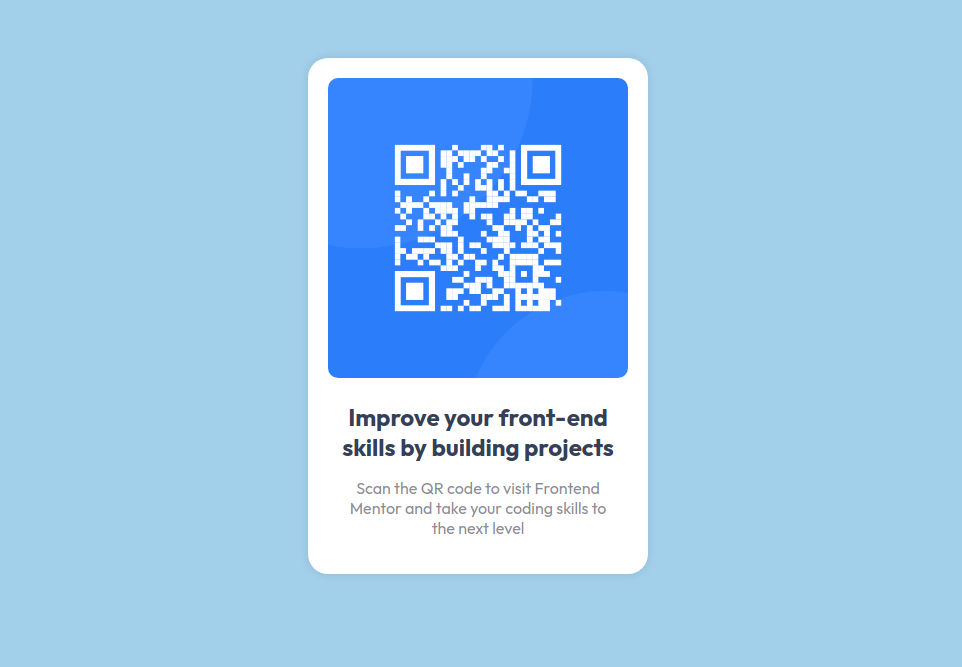

# Frontend Mentor - QR code component solution

This is a solution to the [QR code component challenge on Frontend Mentor](https://www.frontendmentor.io/challenges/qr-code-component-iux_sIO_H). Frontend Mentor challenges help you improve your coding skills by building realistic projects.

## Table of contents

- [Overview](#overview)
    - [Screenshot](#screenshot)
    - [Links](#links)
- [My process](#my-process)
    - [Built with](#built-with)
    - [What I learned](#what-i-learned)


### Screenshot



### Links

- Solution URL: [Add solution URL here](https://your-solution-url.com)
- Live Site URL: https://piotrpieprzyk.github.io/QR-component/

## My process

### Built with

- Semantic HTML5 markup
- CSS (aspect-ratio, display flex)
- FontFace js class

### What I learned

I am proud that during this assignment I took the time to gain new knowledge that me helped improve the metric results such as LCP, CLS.

Images by default have display:inline. That means they are treated as text and have a space below
reserved for descender elements. You can get rid of it in a number of ways:
- add a vertical-align:top rule to the image jsFiddle example
- add font-size:0; to the containing div jsFiddle example
- add display:block; to the image jsFiddle example
  https://stackoverflow.com/questions/19212352/div-height-based-on-child-image-height-adds-few-extra-pixels-at-the-bottom

It is possible to download the font, append it to the website, and set listener for onload in js file.
```js
const font = new FontFace('Outfit', 'url(./fonts/Outfit.woff2)');
font.load().then(function(loaded_face) {
  document.fonts.add(loaded_face);
  document.body.style.fontFamily = 'Outfit';
}).catch(function(error) {
  console.log(error);
});
```

To avoid CLS (Cumulative Layout Shift) we can use aspect-ratio property.
https://developer.mozilla.org/en-US/docs/Web/CSS/aspect-ratio
```css
aspect-ratio: 1/1;
```
